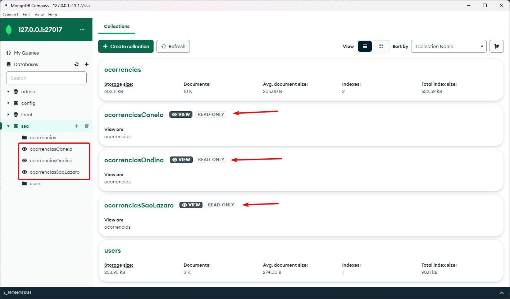
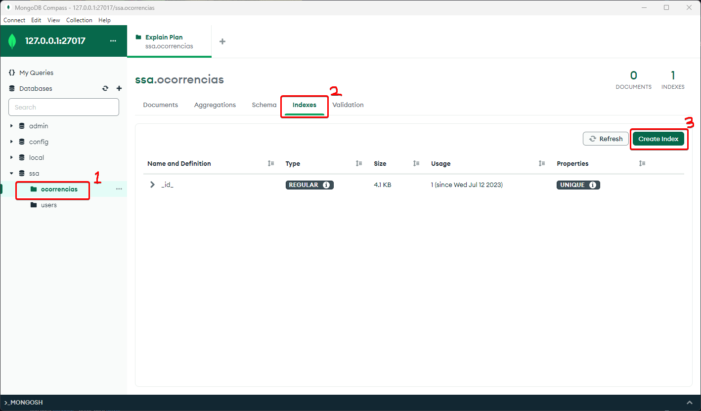
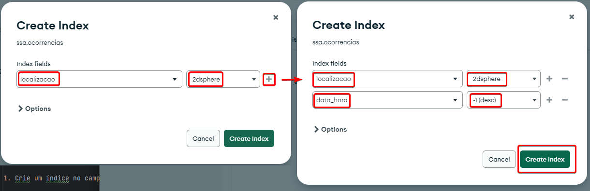

## 2. Visões e Indexação

### Criando nossas visões:

Para criar as nossas visões, parametrizadas para os principais campus da UFBA em Salvador, execute o `create_ocorrencia_views.js`

Ao executar essa operação, 3 views devem ser criadas:

- `ocorrenciasCanela `
- `ocorrenciasOndina`
- `ocorrenciasSaoLazaro`

Para consultar ocorrências nas views criadas, execute o `consult_ocorrencia_views.js`

### Criando nossos índices:

Para criar os nossos índices, utilize o MongoDBCompass e repetindo o processo de criação já ensinado, iremos criar mais dois índices na coleção de ocorrências `ocorrencias`:

1. Crie um índice no campo de `data_hora` do tipo `-1` (descendente)

2. Crie um índice composto nos campos `localizacao` e `data_hora`

