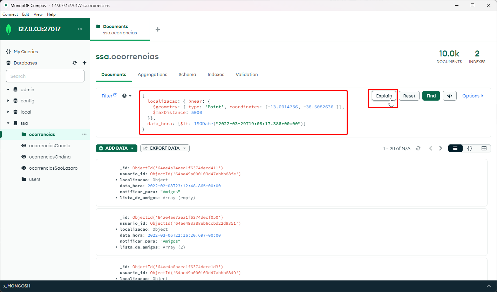
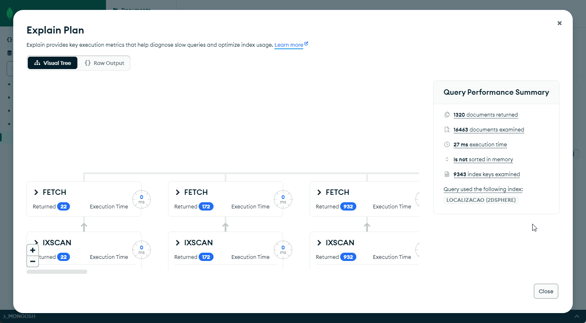
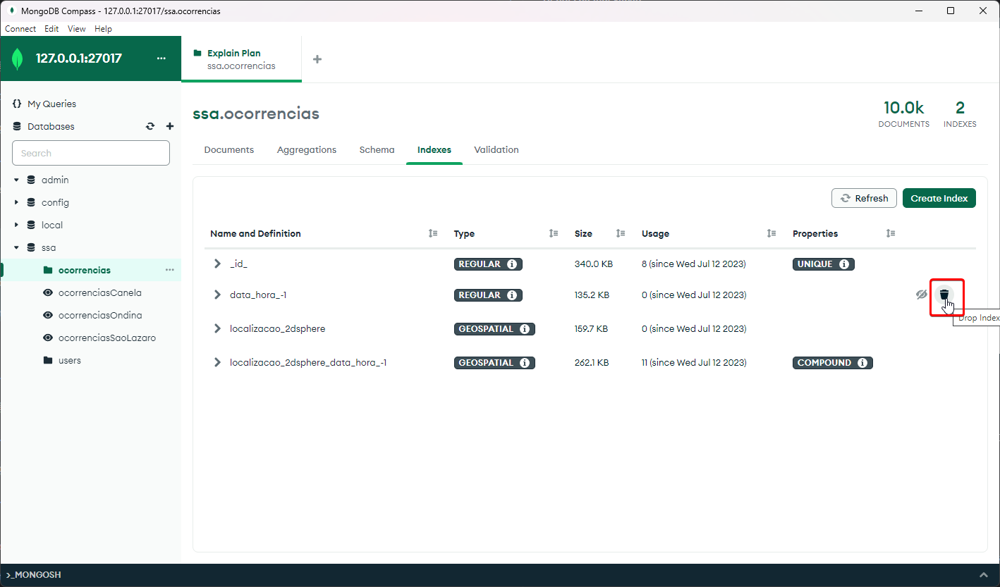

## 3. Otimização

Para testar o impacto dos nossos índices em consultas, utilizaremos novamente o MongoDBCompass, para fazer um explain visual das operações de busca.


Para testar o antes e depois do índice no campo de data_hora utilize a seguinte query:

```js
{data_hora: {$lt: ISODate("2022-03-29T19:08:17.386+00:00")}}
```


**Antes da indexação:**


**Depois da indexação:**


Para testar o antes e depois do índice composto nos campos `localizacao` e `data_hora` utilize a seguinte query:

```js
{
    localizacao: { $near: {
        $geometry: { type: 'Point', coordinates: [-13.0014756, -38.5082636 ]},
        $maxDistance: 5000
    }},
    data_hora: {$lt: ISODate("2022-03-29T19:08:17.386+00:00")}
}
```



**Antes da indexação:**



**Depois da indexação:**


**Observação:**

Caso seja necessário deletar um índice para a execução do teste, isso pode ser feito na página de criação de índices.



Após clicar para remover o índice e confirmar sua remoção, o teste pode ser reexecutado.

**Importante:**

Quando o índice composto for criado, é possível que o MongoDB demore algum tempo até decidir começar a usá-lo (Pode ser minutos ou até horas). Para motivos de testes, recomendamos que delete o índice `localizacao_2dsphere` no campo `localizacao` para forçar o Mongo a usar o índice composto.
