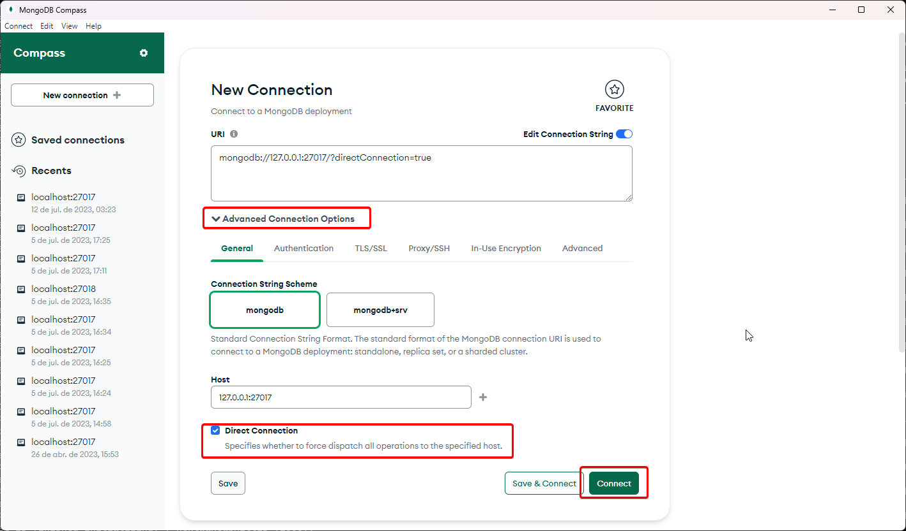
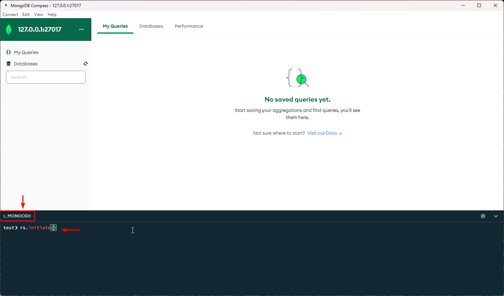

## 5. Transações

Para poder utilizar transações no mongodb, a replicação deve estar ativada. Para isso, encerre a instância do banco e reinicie ela usando o parâmetro `--replSet rs0`

Nosso comando para iniciar o banco ficará da seguinte forma:

`./mongod.exe --bind_ip 127.0.0.1 --port 27017 --dbpath "C:\Users\Luca\Documents\mongo-data" --replSet rs0`

Após reiniciar o banco, será preciso reconectar o MongoDBCompass fazendo uma conexão direta.

Com o Compass conectado, será preciso iniciar o set de replicação. Para isso é preciso abrir o MongoSH (Mongo Shell) e executar o comando `rs.initiate()`

Para executar uma transação que cria uma ocorrência a partir de um usuário aleatório, e tenta atualizar a localização do usuário antes de criar a ocorrência, execute o `create_ocorrencia_transaction.js`

Observação: Para testar a transação em caso de falha, descomente a linha 53.