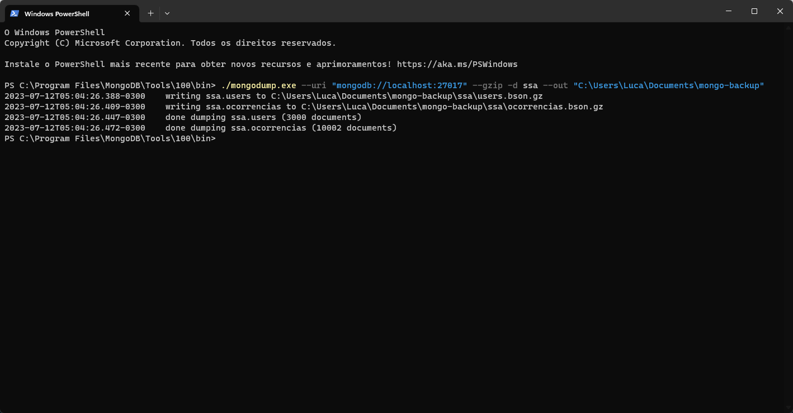

## 8. Backup e Recuperação

Para facilitar o processo de backup e recuperação, é necessário desligar a autenticação.

Nosso comando para iniciar o banco ficará da seguinte forma:

`./mongod.exe --bind_ip 127.0.0.1 --port 27017 --dbpath "C:\Users\Luca\Documents\mongo-data"`

Faremos o backup e recuperação a partir do utilitário `mongodump`

Para isso, é preciso fazer o download das [ferramentas de linha de comando do MongoDB.](https://www.mongodb.com/try/download/database-tools)

Caso seja necessário é possível seguir o [tutorial oficial de instalação das ferramentas de linha de comando.](https://www.mongodb.com/docs/database-tools/installation/installation/)

Com as ferramentas já instaladas.

### Fazendo Backup

**Windows:**

- Crie uma pasta onde os dados do banco serão guardados.
- Vá para o local onde o MongoDB Command Line Tools foi instalado (por padrão "C:\Program Files\MongoDB\Tools\100\bin")
- Abra o terminal na pasta onde o MongoDB Command Line Tools foi instalado e execute o seguinte comando: `./mongodump.exe --uri "mongodb://localhost:27017" --gzip -d ssa --out "pasta"`
- No nosso caso, o comando executado foi: `./mongodump.exe --uri "mongodb://localhost:27017" --gzip -d ssa --out "C:\Users\Luca\Documents\mongo-backup"`

**Linux:**

- Crie uma pasta onde os dados do banco serão guardados.
- Abra o terminal e execute o seguinte comando: `mongodump --uri "mongodb://localhost:27017" --gzip -d ssa --out "pasta"`

### Fazendo Restauração

**Windows:**

- Vá para o local onde o MongoDB Command Line Tools foi instalado (por padrão "C:\Program Files\MongoDB\Tools\100\bin")
- Abra o terminal na pasta onde o MongoDB Command Line Tools foi instalado e execute o seguinte comando: `./mongorestore.exe --uri "mongodb://localhost:27017" --gzip "pasta/ssa" -d ssa`
- No nosso caso, o comando executado foi: `./mongorestore.exe --uri "mongodb://localhost:27017" --gzip "C:\Users\Luca\Documents\mongo-backup\ssa" -d ssa`

**Linux:**

- Abra o terminal e execute o seguinte comando: `mongorestore --uri "mongodb://localhost:27017" --gzip "pasta/ssa" -d ssa`

Para demonstração, fizemos a restauração para um banco auxiliar que chamamos de `ssa_res`.

Utilizamos o seguinte comando:

`./mongorestore.exe --uri "mongodb://localhost:27017" --gzip "C:\Users\Luca\Documents\mongo-backup\ssa" -d ssa_res`

**Resultado:**

