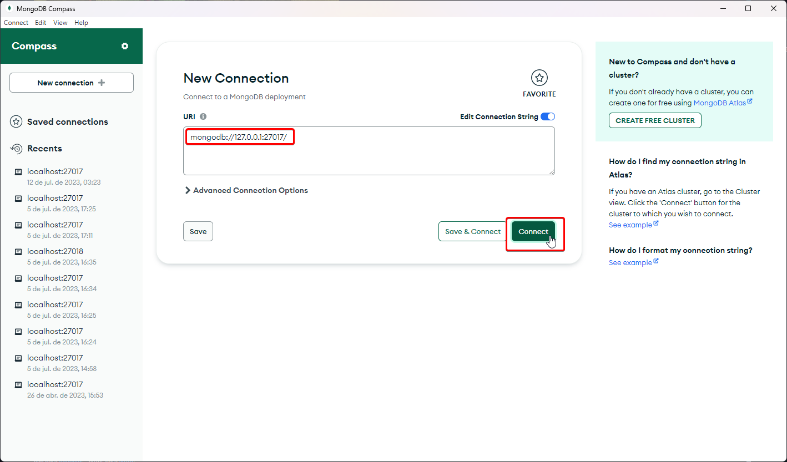
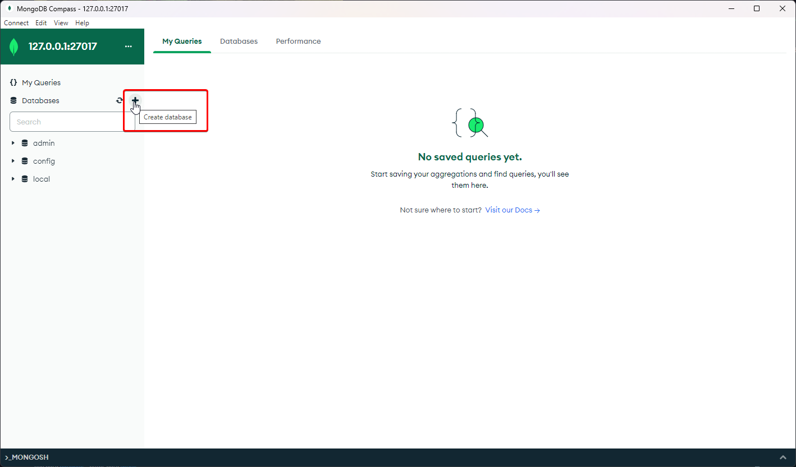
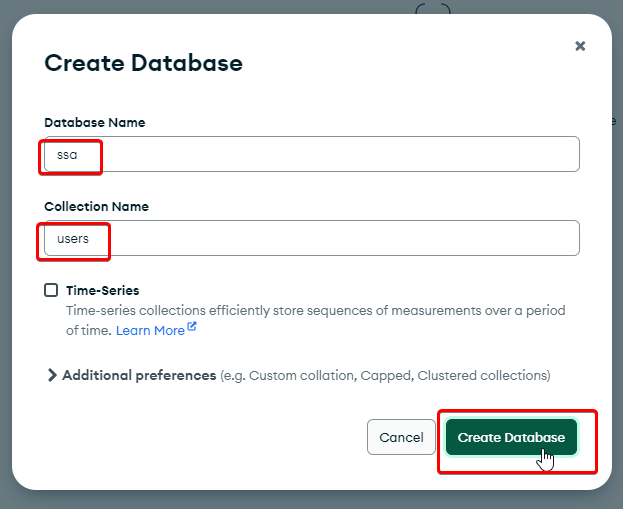
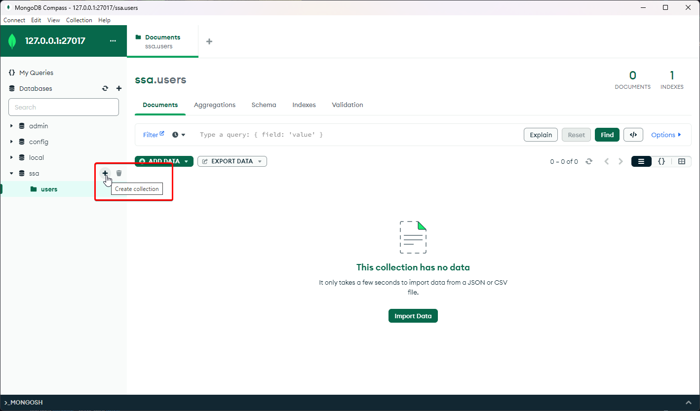
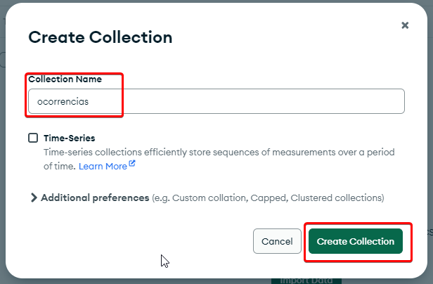
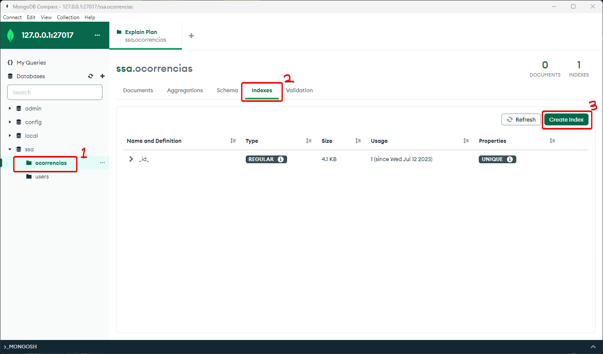
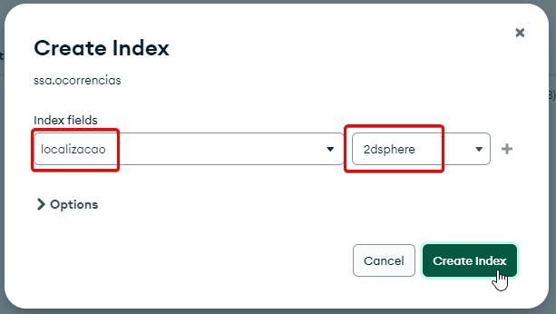

## Instalação e Configuração

Aqui está uma instrução principal para instalar o MongoDB, o MongoDB Compass, além de algumas operações básicas como conectar MongoCompass, bem como criar o banco de dados "ssa" e as coleções "users" e "ocorrencias".

**1. Instalando MongoDB:**

Siga as etapas a seguir para instalar o MongoDB:

**Windows:**

- Vá para a [página de downloads do MongoDB](https://www.mongodb.com/download-center/community).

- Selecione o sistema operacional apropriado no menu suspenso.

- Escolha o pacote de "Download msi". Em seguida, faça o download.

- Execute o instalador que foi baixado.

- Siga as instruções na configuração.

**Linux:**

- Abra um terminal.

- Atualize o sistema operacional com `sudo apt-get update`.

- Instale o MongoDB com `sudo apt-get install -y mongodb`.

**2. Instalando MongoDB Compass:**

- Navegue até a [página de downloads do Compass](https://www.mongodb.com/download-center/compass).

- Escolha a versão mais recente e o sistema operacional apropriado.

- Clique no botão de download.

- Após o download, abra o instalador e siga as instruções.

**3. Iniciando o banco:**

**Windows:**

- Crie uma pasta onde os dados do banco serão guardados.
- Vá para o local onde o MongoDB foi instalado (por padrão "C:\Program Files\MongoDB\Server\6.0\bin")
- Abra o terminal na pasta onde o MongoDB foi instalado e execute o seguinte comando: `./mongod.exe --bind_ip 127.0.0.1 --port 27017 --dbpath "pasta"`
- No nosso caso, o comando executado foi: `./mongod.exe --bind_ip 127.0.0.1 --port 27017 --dbpath "C:\Users\Luca\Documents\mongo-data"`

**Linux:**

- Crie uma pasta onde os dados do banco serão guardados.
- Abra o terminal e execute o seguinte comando: `mongod --bind_ip 127.0.0.1 --port 27017 --dbpath "pasta"`

**4. Conectando ao MongoDB através do Compass:**

- Abra o MongoDB Compass.
- Na janela de nova conexão que aparece, verifique se o ip e porta estão corretos, e em seguida clique em conectar.

**5. Criando um banco de dados e coleções:**

- Na interface do MongoDB Compass, clique em "Create". Isso abrirá um popup.

- Digite "ssa" como o nome do banco de dados.
- Digite "users" como o nome da primeira coleção.
- Clique em "Create Database".

- O banco de dados "ssa" agora deve estar visível na lista de bancos de dados.
- Clique nele para ver as coleções. Deveria haver uma coleção chamada "users".
- Para criar uma nova coleção chamada "ocorrencias", clique em "Create Collection".

- Digite "ocorrencias" como o nome da coleção e clique em "Create".

**6. Índice Geoespacial**

Para realizar operações de busca em pontos de localização das ocorrências, um índice geoespacial deve ser obrigatoriamente criado.

- Abra a janela da coleção de ocorrências, navegue para a aba de índices e clique em Create Index.
  
- Configure o campo do índice para `localizacao` e o tipo do índice para `2dsphere`. Por fim clique em criar índice.
  

Pronto, o banco está configurado e já deverá ser possível executar os códigos.

